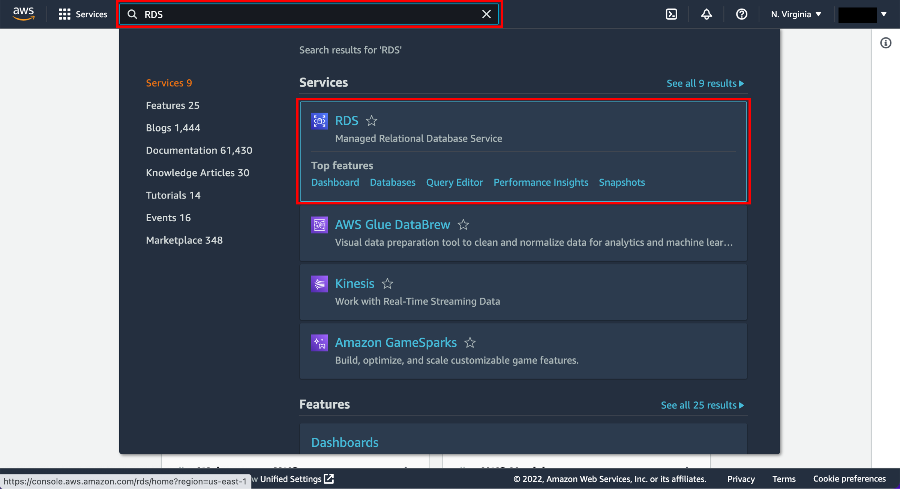

# Multi-service-web-application
Design and deployment of a highly available web application on AWS using Terraform. The application utilizes multiple AWS services and consider cost optimization.

# Deploy WordPress with Amazon RDS
WordPress is a highly popular content management system (CMS) that is used for over 30% of all sites on the internet. It is most commonly used for blogs but can also be used for running e-commerce sites, message boards, and many other popular use cases.

# What you will accomplish
WordPress requires a MySQL database to store its data.
 
In the modules that follow, we will see how to configure a WordPress installation using Amazon RDS for MySQL. To configure this WordPress site, we will create the following resources in AWS:
 1. An Amazon EC2 instance to install and host the WordPress application
 2. An Amazon RDS for MySQL database to store your WordPress data

# Implementation
 a. Open the AWS Management Console. When the screen loads, enter RDS in the search bar, then select RDS to open the service console.

