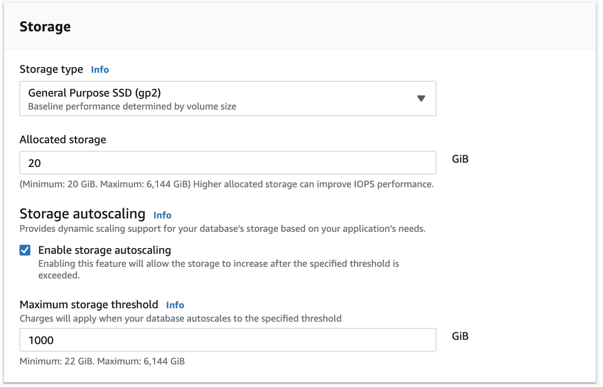

# Multi-service-web-application
Design and deployment of a highly available web application on AWS using Terraform. The application utilizes multiple AWS services and consider cost optimization.

# Deploy WordPress with Amazon RDS
WordPress is a highly popular content management system (CMS) that is used for over 30% of all sites on the internet. It is most commonly used for blogs but can also be used for running e-commerce sites, message boards, and many other popular use cases.

# What you will accomplish
WordPress requires a MySQL database to store its data.
 
In the modules that follow, we will see how to configure a WordPress installation using Amazon RDS for MySQL. To configure this WordPress site, we will create the following resources in AWS:
 1. An Amazon EC2 instance to install and host the WordPress application
 2. An Amazon RDS for MySQL database to store your WordPress data

# Implementation
a. Open the AWS Management Console. When the screen loads, enter RDS in the search bar, then select RDS to open the service console.

b. Choose the Create database button to get started.

c. The first step is to choose the database engine you want to use. Amazon RDS supports six different engines, from popular open-source options like MySQL and PostgreSQL, to commercial options like Oracle and Microsoft SQL Server, to a cloud-native option called Amazon Aurora that was custom-built to take advantage of the cloud.
 
WordPress uses MySQL, so select Standard create for the database creation method and choose the MySQL engine.

d. In the Templates section of the creation wizard, there is an option to only show options that are available in the AWS Free Tier. Select this option to complete the learning in this guide without incurring costs.

In a production setup, you may want to use features of Amazon RDS that are outside the Free Tier. These include:

A larger database instance class, for improved performance
Multi-AZ deployments, for automatic failover and recovery in the event of an infrastructure issue
Provisioned IOPS for disk storage, for faster I/O performance

e. Next, you will specify the authentication settings for your MySQL deployment. These include the database name and the master username and password.

In the Settings section, enter wordpress as your DB instance identifier. Then specify the master username and password for your database. Choose a strong, secure password to help protect your database. Store the username and password for safekeeping as you will need it in a later module.

f. After setting your username and password, you can select key details about your MySQL deployment. This includes the instance configuration and storage details.
 
The default settings will work for this guide. You will use a small instance class that is suitable for testing or small-scale applications, and it fits within the AWS Free Tier. If you don’t want to use the AWS Free Tier, you could set a larger instance class or alter the storage configuration options.

g. Next, you can configure connectivity and network settings. Amazon RDS instances must be created in an Amazon VPC, which is a logically separate network where your provisioned resources will live.

VPCs are an advanced topic outside the scope of this guide. Fortunately, AWS has created a default VPC in each Region in your account. The default VPC is already selected for you, and you can launch your Amazon RDS instance in this VPC.

h. Finally, Amazon RDS provides a number of additional configuration options to customize your deployment. You need to make one change in this area. Select the Additional configuration line to expand the options. Set the Initial database name to wordpress. This will ensure Amazon RDS creates the database in your MySQL instance upon initialization. You will use this database name when connecting to your database.

i. Retain the default settings for the remainder of options. At the bottom of the creation wizard, AWS will show you estimated monthly costs for your Amazon RDS database. If you are still eligible for the Amazon RDS Free Tier, you will see a note that the database will be free to you for up to 12 months.
Choose the Create database button to create your database.

j. You should see a success notice indicating that your database is being created.

a. To create your EC2 instance, go to Amazon EC2 in the AWS Management Console. Choose the Launch instance button to open the instance creation wizard.

b. On the first page, enter wordpress app as your instance name.

c. Next, choose an Amazon Machine Image (AMI). The AMI you choose will determine the base software that is installed on your new EC2 instance. This includes the operating system (Amazon Linux, Red Hat Enterprise Linux, Ubuntu, Microsoft Server, etc.), and the applications that are installed on the machine.

Many AMIs are general-purpose AMIs for running many different applications, but some are purpose-built for specific use cases, such as the Deep Learning AMI or various AWS Marketplace AMIs.

The Amazon Linux distro is a popular choice, so choose the Amazon Linux 2 AMI (HVM) in the AMI selection view.

Scroll down to select an EC2 instance type. An instance type is a particular configuration of CPU, memory (RAM), storage, and network capacity.

AWS has a huge selection of instance types that cover many different workloads. Some are geared toward memory-intensive workloads, such as databases and caches, while others are aimed at compute-heavy workloads, such as image processing or video encoding.

Amazon EC2 allows you to run 750 hours per month of a t2.micro instance under the AWS Free Tier. Select this option for this guide so that you won’t incur any costs on your bill.

a. Select the t2.micro instance.

You will see a details page on how to configure a key pair for your instance. You will use the key pair to SSH into your instance, which will give you the ability to run commands on your server.

a. Open the key pair (login) section and choose Create new key pair for your instance.

b. Give your key pair a name. Then choose the Create key pair button, which will download the .pem file to your machine. You will use this file in the next module.
