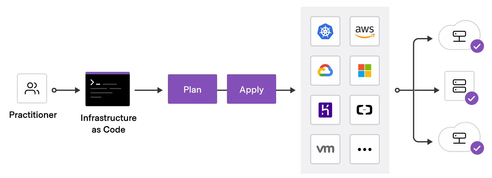

# Infrastructure as Code with Terraform - Standardize your deployment workflow
To deploy infrastructure with Terraform:
1. Scope - Identify the infrastructure for your project.
2. Author - Write the configuration for your infrastructure.
3. Initialize - Install the plugins Terraform needs to manage the infrastructure.
4. Plan - Preview the changes Terraform will make to match your configuration.
5. Apply - Make the planned change

# Initialize the directory
When you create a new configuration — or check out an existing configuration from version control — you need to initialize the directory with "terraform init".

Initializing a configuration directory downloads and installs the providers defined in the configuration, which in this case is the aws provider.

Initialize the directory.

$ terraform init

Terraform downloads the aws provider and installs it in a hidden subdirectory of your current working directory, named .terraform. The terraform init command prints out which version of the provider was installed. Terraform also creates a lock file named .terraform.lock.hcl which specifies the exact provider versions used, so that you can control when you want to update the providers used for your project.

# Format and validate the configuration
We recommend using consistent formatting in all of your configuration files. The terraform fmt command automatically updates configurations in the current directory for readability and consistency.

Format your configuration. Terraform will print out the names of the files it modified, if any. In this case, your configuration file was already formatted correctly, so Terraform won't return any file names.

$ terraform fmt

You can also make sure your configuration is syntactically valid and internally consistent by using the terraform validate command.

Validate your configuration. The example configuration provided above is valid, so Terraform will return a success message.

$ terraform validate

# Review and Create infrastructure
Preview the changes Terraform will make to match your configuration.

$ terraform plan

Apply the configuration now with the terraform apply command. Terraform will print output similar to what is shown below. We have truncated some of the output to save space.

$ terraform apply

Before it applies any changes, Terraform prints out the execution plan which describes the actions Terraform will take in order to change your infrastructure to match the configuration.